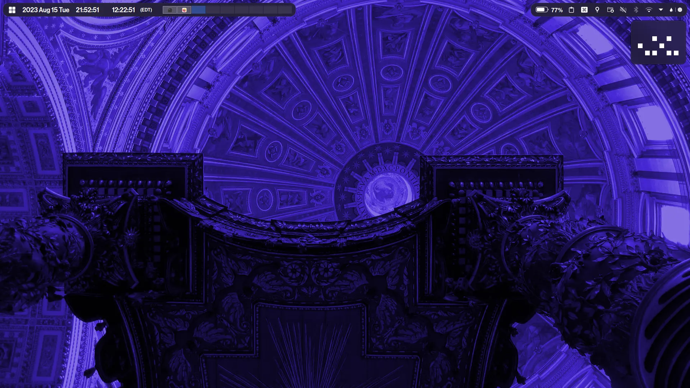

# dotfiles (powered by [konsave](https://github.com/Prayag2/konsave))

## details

- **os**: arch linux
- **de**: kde plasma
- **terminal**: konsole
- **application style**: [lightly](https://github.com/Luwx/Lightly)
- **plasma style**: [whitesur-kde](https://github.com/vinceliuice/WhiteSur-kde)
- **colors**: [deepinv20-dark](https://github.com/yeyushengfan258/DeepinV20-kde)
- **window decoration**: KDE-gaps-glow
- **fonts**: oneplus sans, [fantasque sans mono NF](https://github.com/ryanoasis/nerd-fonts/tree/master/patched-fonts/FantasqueSansMono)
- **icons**: [whitesur icons](https://github.com/vinceliuice/WhiteSur-icon-theme)
